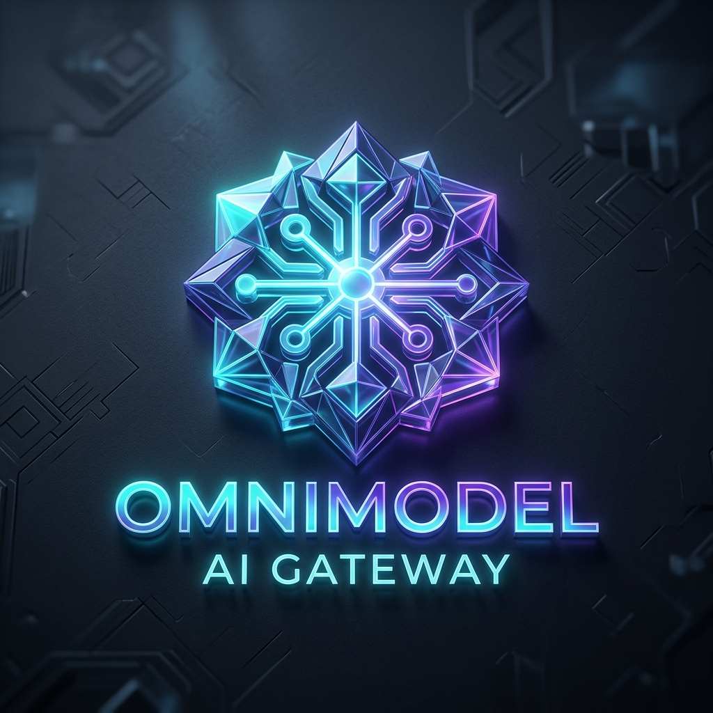

<div align="center">



# 🧠 OmniModel Universal AI Gateway
### Antigravity AI Agent Integration Hub — 2026 Edition

[](https://vercel.com/new/clone?repository-url=https://github.com/ishitjainnimsuniversity-ai/OmniModel-AI-Gateway)
[](https://www.python.org/)
[](https://fastapi.tiangolo.com)
[](http://127.0.0.1:8000/v1)
[](LICENSE)

*A unified multi-model orchestration gateway, autonomous intent router, multi-model parallel arena, and OpenAI drop-in proxy integrating 20+ top AI providers with 100% free-tier zero-cost auto-routing.*

</div>

---

## 🌟 Key Highlights

- **⚡ 20+ AI Providers Integrated**: Google Gemini, Groq (500+ tok/s), OpenRouter, DeepSeek R1/V3, Anthropic Claude 3.7, OpenAI GPT-4o/o3, Mistral, Cerebras (2000+ tok/s), SambaNova, Cohere, Together AI, Fireworks, Perplexity, xAI Grok, Hugging Face, Replicate, Stability AI, AI21 Labs, Azure Foundry, Amazon Bedrock, and Local Offline Ollama.
- **🆓 100% Free-Tier Hub**: Auto-routes queries to verified zero-cost endpoints (Google AI Studio Gemini, Groq Free Tier, OpenRouter `:free` models, Cerebras Free, SambaNova Free, and Local Ollama).
- **🥊 4-Way Model Arena**: Broadcast prompts across 4 models simultaneously in real time to compare generation speed (tokens/sec), latency, and response quality.
- **🛡️ Auto-Fallback Waterfall**: Seamless failover to backup providers on rate limits (HTTP 429), quota limits, or network errors.
- **📊 User Activity & Telemetry Analytics**: Tracks active users, client IPs, platforms (Python SDK, Web, cURL), latency, and token throughput.
- **📡 Universal OpenAI Drop-in Proxy**: Works as a drop-in replacement at `http://localhost:8000/v1` for any AI tool, Cursor, LangChain, or custom script.

---

## 🚀 Quickstart

### 1. Local Clone & Setup

```bash
# Clone repository
git clone https://github.com/ishitjainnimsuniversity-ai/OmniModel-AI-Gateway.git
cd OmniModel-AI-Gateway

# Install dependencies
pip install -r requirements.txt

# Run gateway server
python server.py
# Or on Windows, double-click start.bat
```

Open your browser to [**http://127.0.0.1:8000**](http://127.0.0.1:8000) for the Web Dashboard & Arena.

---

## ☁️ Deployments

### A. 1-Click Deploy to Vercel

[](https://vercel.com/new/clone?repository-url=https://github.com/ishitjainnimsuniversity-ai/OmniModel-AI-Gateway)

1. Click the button above to import into your Vercel account.
2. In Project Settings -> Environment Variables, add any API keys you wish to activate (e.g. `GEMINI_API_KEY`, `GROQ_API_KEY`, `OPENROUTER_API_KEY`).
3. Deploy!

### B. Docker & AWS (App Runner / ECS)

```bash
# Build & run container locally
docker-compose up --build

# Push to AWS ECR / App Runner
docker build -t omnimodel-gateway:latest .
```

---

## 💻 Antigravity & Python SDK Usage

```python
from antigravity_bridge import OmniAI

ai = OmniAI()

# 1. Smart Intent Auto-Routing (automatically picks optimal model):
print(ai.chat("Explain quantum key distribution with Python simulation code."))

# 2. Use 100% Free Tier:
print(ai.chat("Write a fast binary search in Python", profile="free_tier"))

# 3. Direct Provider Query:
print(ai.chat("Hello Gemini", provider="gemini", model="gemini-2.0-flash"))
```

### Standard OpenAI Python SDK Proxy

```python
from openai import OpenAI

client = OpenAI(
    base_url="http://localhost:8000/v1",
    api_key="omnimodel-local"
)

response = client.chat.completions.create(
    model="auto", # or "free_tier", "groq/llama-3.3-70b-versatile", etc.
    messages=[{"role": "user", "content": "How does self-attention work?"}],
    stream=True
)

for chunk in response:
    print(chunk.choices[0].delta.content or "", end="", flush=True)
```

---

## 🔌 Integrated Provider Matrix

| Provider | Flagship & Free Models | Category | Free Tier Link |
|---|---|---|---|
| **Google Gemini** | `gemini-2.0-flash`, `gemini-2.0-flash-thinking` | Frontier Multimodal | [Google AI Studio](https://aistudio.google.com/app/apikey) |
| **Groq** | `llama-3.3-70b-versatile`, `qwen-2.5-32b` | 500+ tok/s LPU | [Groq Console](https://console.groq.com/keys) |
| **OpenRouter** | `deepseek/deepseek-r1:free`, `meta-llama/llama-3.3-70b:free` | Free Model Pool | [OpenRouter](https://openrouter.ai/settings/keys) |
| **DeepSeek** | `deepseek-reasoner` (R1), `deepseek-chat` (V3) | Deep Reasoning | [DeepSeek Platform](https://platform.deepseek.com/api_keys) |
| **Cerebras** | `llama3.1-70b` (2000+ tok/s) | Wafer-Scale | [Cerebras Cloud](https://cloud.cerebras.ai/) |
| **SambaNova** | `Meta-Llama-3.3-70B`, `Llama-3.1-405B` | Giant Model Speed | [SambaNova Cloud](https://cloud.sambanova.ai/) |
| **Hugging Face** | `Llama-3.3-70B-Instruct` | Open-Source Hub | [Hugging Face](https://huggingface.co/settings/tokens) |
| **Cohere** | `command-r-plus-08-2024` | Enterprise RAG | [Cohere Dashboard](https://dashboard.cohere.com/api-keys) |
| **Mistral AI** | `codestral-latest`, `mistral-large` | European Frontier | [Mistral Console](https://console.mistral.ai/api-keys/) |
| **Anthropic** | `claude-3-7-sonnet`, `claude-3-5-haiku` | Elite Coding | [Anthropic Console](https://console.anthropic.com/settings/keys) |
| **OpenAI** | `gpt-4o`, `gpt-4o-mini`, `o1`, `o3-mini` | Flagship GPT | [OpenAI Platform](https://platform.openai.com/api-keys) |
| **Perplexity** | `sonar-reasoning-pro`, `sonar` | Live Web Search | [Perplexity AI](https://www.perplexity.ai/settings/api) |
| **Local Ollama**| `llama3.2`, `deepseek-r1` | 100% Offline Free | [Ollama](https://ollama.ai/) |

---

## 📄 License
MIT License © 2026 Ishit Jain & Antigravity Community.
